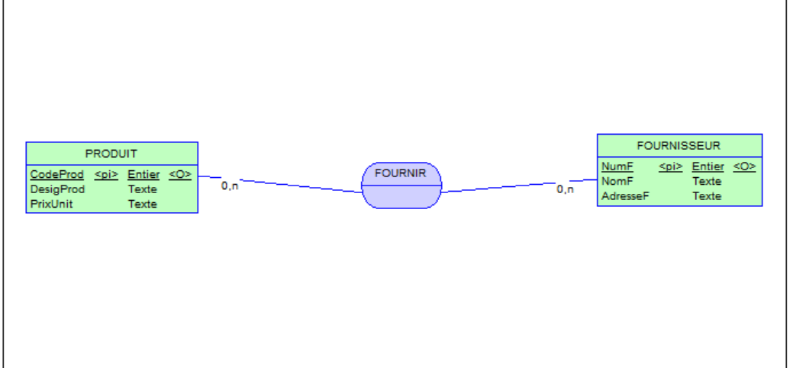
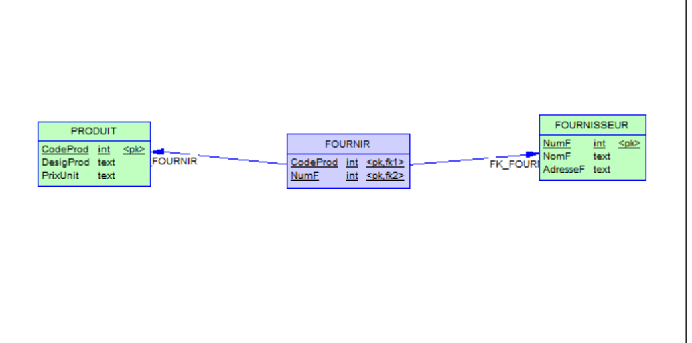

"# Merise_lab1" 

# 🧪 Lab 1 — Modélisation de Données (MCD, MLD, MPD & SQL)

## 📘 Introduction
Ce laboratoire a pour objectif de construire un système de données simple gérant :
- des **produits**
- des **fournisseurs**
- et la relation **FOURNIR** permettant de connaître le prix d’achat d’un produit chez un fournisseur.

Ce README présente :
1. Le **dictionnaire de données**
2. Le **Modèle Conceptuel de Données (MCD)**
3. Le **Modèle Logique de Données (MLD)**
4. Le **Modèle Physique de Données (MPD)**
5. Le **script SQL** généré par PowerAMC
6. La **procédure de génération** utilisée

---

# 1️⃣ Dictionnaire de données

| Nom symbolique | Description | Nature | Type | Contraintes | Appartient à |
|----------------|-------------|--------|------|-------------|--------------|
| CodeProd | Code unique du produit | NC | AN (Texte) | Unique, obligatoire | PRODUIT |
| DesigProd | Désignation du produit | NC | AN | Obligatoire | PRODUIT |
| PrixUnit | Prix unitaire du produit | NC | Décimal | > 0, obligatoire | PRODUIT |
| NumF | Identifiant du fournisseur | NC | Entier | Unique, obligatoire | FOURNISSEUR |
| NomF | Nom du fournisseur | NC | AN | Obligatoire | FOURNISSEUR |
| AdresseF | Adresse du fournisseur | NC | AN | Obligatoire | FOURNISSEUR |
| PrixAchat | Prix du produit chez un fournisseur | NC | Décimal | > 0, obligatoire | FOURNIR |

---

# 2️⃣ Modèle Conceptuel de Données (MCD)

Le MCD représente les entités suivantes :

- **PRODUIT (1,n)**  
- **FOURNIR (association, n,n)**  
- **FOURNISSEUR (1,n)**  

### 📌 Cardinalités
- Un **produit** peut être fourni par plusieurs fournisseurs  
- Un **fournisseur** peut fournir plusieurs produits  
- La relation **FOURNIR** porte l’attribut **PrixAchat**

### 📷 MCD (image)

### 📷 MPD (image)

